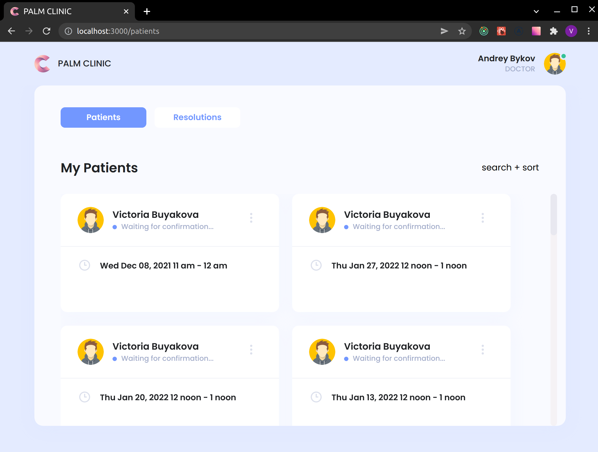

## Palm Clinic

An application used to book the doctor visit, built with React, Redux-Toolkit, TypeScript, styled-components and redux-saga.

## Project Status

This project is currently in development. Users can book the doctor visit and doctors can create a resolution.

## Project Screen Shot

## Installation and Setup Instructions

Clone down this repository. You will need `node` and `npm` or `yarn` installed globally on your machine.

Installation:

`npm install` or `yarn`

To Run Test Suite:

`npm test` or `yarn test`

To Start Server:

`npm start` or `yarn run`

To Visit App:

`https://itrex-lab.vercel.app/sign-in`

## Reflection

This project built during ITRex React.JS-lab
