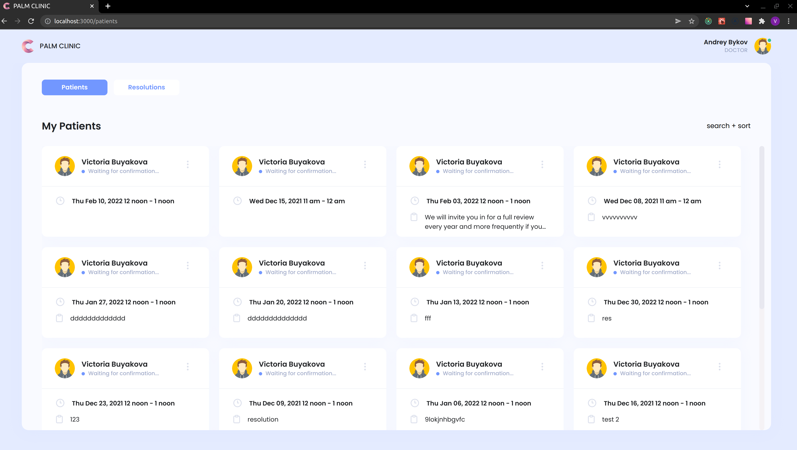
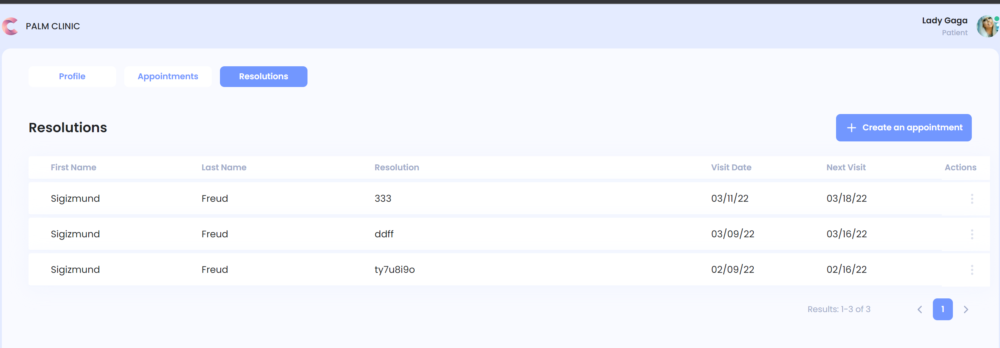
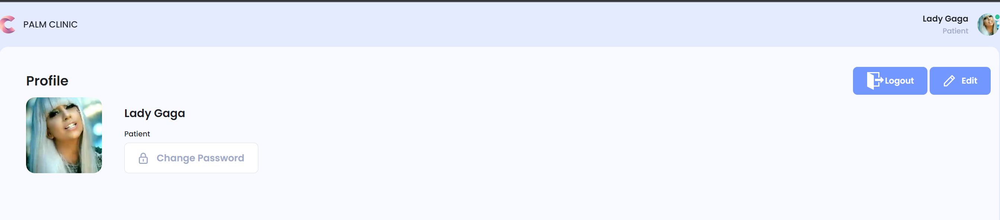
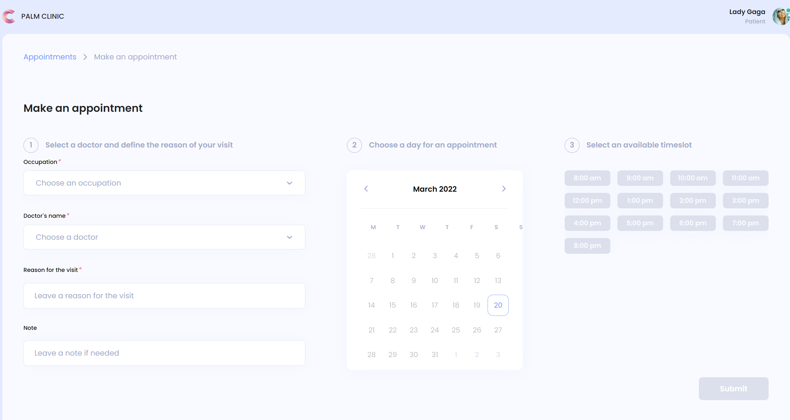

## Palm Clinic

Palm Clinic is an application used to book the doctor visit, built with React, Redux-Toolkit, TypeScript, styled-components and redux-saga.

## Project Status

This project completed. `Patient` can book the doctor visit and see his
resolutions. `Doctor` can create, edit and delete a resolution. Also doctor can
confirm or reject an appointment.
`Admin` can create, edit and delete doctors and patients.

## Installation and Setup Instructions

Clone down this repository. You will need `node` and `yarn` and `git` installed globally on your machine.

1. Install [Git](https://git-scm.com/book/en/v2/Getting-Started-Installing-Git)
2. Clone down this [repository](https://github.com/Feralwater/itrex-lab)
3. Install [Node](https://nodejs.org/en/download/package-manager/)
4. Run following command in terminal: `yarn`

You may see API here: [Swagger UI](https://reactlabapi.herokuapp.com/api/docs/#/)

You may handle test application with this credentials:

Admin userName: `alexey@mail.ru`
Admin password: `alexey@mail.ru`

Doctor userName: `email@gmal.com`
Doctor password: `password`

User userName: `lady@gmal.com`
User password: `password`

To Start Server:

`yarn run`

To Visit App: [deploy](https://itrex-lab.vercel.app/sign-in)

## Reflection

This project built during ITRex React.JS-lab

## Project Screen Shots

